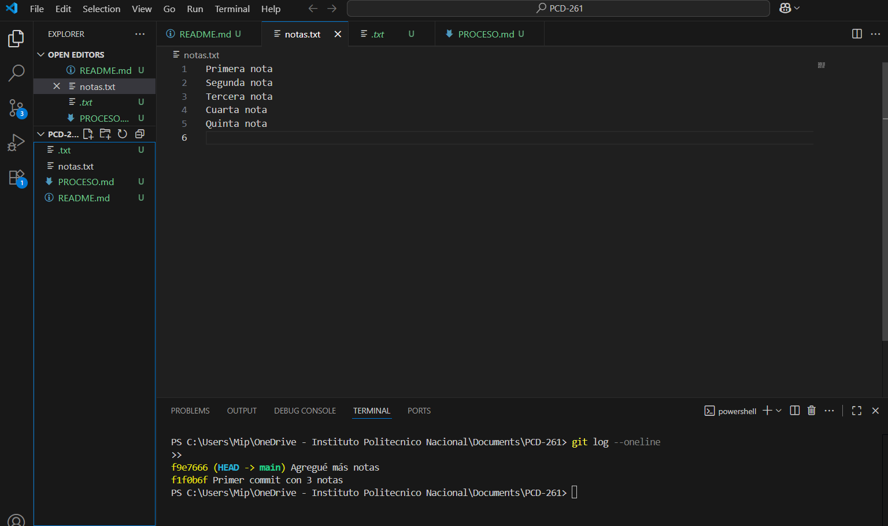

# Documentación de la práctica

## Pasos realizados
1. Creé el repositorio con `git init`.
2. Agregué el archivo `notas.txt` con 3 notas.
3. Hice el primer commit:  
   ```bash
   git add notas.txt
   git commit -m "Primer commit con 3 notas"
   git commit -m "Agregué más notas"
   git commit -m "Agregué evidencias en PROCESO.md"
   git commit -m "Primer commit incluyendo archivos y evidencias"
## Evidencia de git log
